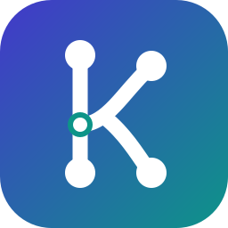

<div align="center">

<a href="https://semans.github.io/kontext/" target="_blank">
  
</a>

### kontext: the team context bridge for coding agents

English / [Slovenčina](README_SK.md)

<a href="https://semans.github.io/kontext/">Docs</a> · <a href="https://semans.github.io/kontext/getting-started/03-quickstart">Quick start</a> · <a href="https://github.com/SemanS/kontext/releases">Releases</a> · <a href="https://github.com/SemanS/kontext/issues">Issues</a> · <a href="https://github.com/SemanS/kontext/discussions">Discussions</a>

<p>
  <a href="https://github.com/SemanS/kontext/releases"></a>
  <a href="https://github.com/SemanS/kontext/actions/workflows/ci.yml"></a>
  <a href="#license"></a>
  <a href="https://github.com/SemanS/kontext"></a>
  <a href="https://github.com/SemanS/kontext/issues"></a>
  <a href="https://github.com/SemanS/kontext/commits/main"></a>
  
  
</p>

</div>

***

## What is kontext

kontext gives every coding agent you run (Claude Code, Codex, Cursor, OpenCode, anything that speaks MCP) the same short, **reviewed** memory of *why the code is the way it is*, and turns "the agent figured something out" into "the team knows it" through ordinary commits.

It is one fast Rust binary with three faces: an **MCP server** (`kontext mcp`), a **CLI**, and a set of **git hooks**. Team knowledge lives in the repository as short Markdown files. Everything else (semantic memory, session archives, code intelligence, LLMs) plugs in as a **configured adapter**; kontext's code never names a product.

```text
                 Claude Code · Codex · Cursor · OpenCode · any MCP client
                                         │  MCP (stdio)
                                ┌────────┴────────┐
                                │     kontext     │  ctx_brief · ctx_search · ctx_read · ctx_why
                                │  (Rust, 1 bin)  │  ctx_capture · ctx_prepare_commit · ctx_init …
                                └──┬─────┬─────┬──┘
             adapters (config) ────┘     │     └──── git hooks
   ┌──────────────┬──────────────┐       │       pre-commit: validate + secret-scan + index
   │ mcp driver   │ http driver  │       │       prepare-commit-msg: `Decision: <id>` trailers
   │ CodeGraph    │ OpenViking   │       │       post-commit/merge/rewrite: `sync` events
   │ Serena       │ Ollama       │       │
   │ Agent LCM    │ Slack hook   │       ▼
   │ sessions     │ …            │   TEAM TRUTH (git)                LOCAL, DERIVED, PRIVATE
   │ command drv  │              │   .ai/decisions/*.md   ◄─ PR ──   .git/kontext/inbox (candidates)
   │ claude -p    │              │   .ai/conventions/…               .git/kontext/…/index (Tantivy)
   │ codex exec   │              │   .ai/learnings/…                 outbox (adapter deliveries)
   └──────────────┴──────────────┘   .ai/architecture/…              init cache, sync snapshots
```

## Why kontext

- **Git is the source of truth, and agents never change it on their own.** A capture lands in a local inbox; it becomes team knowledge only when it is promoted *into a commit* and reviewed in the pull request next to the code it explains. → [Capture and review](https://semans.github.io/kontext/concepts/03-capture-and-review)
- **One brief, budgeted.** `ctx_brief` returns the active decisions, conventions, pitfalls and module map in ~1–2k tokens, ranked for the paths the agent is about to touch; details come on demand at L0/L1/L2. → [Context layers](https://semans.github.io/kontext/concepts/04-context-layers)
- **"Why is this like this?" from git itself.** `ctx_why path[:line]` combines the decisions that cover the path, its module summary, decision-shaped commits, `git blame` and your session-history adapters; commits carry `Decision: <id>` trailers. → [Retrieval](https://semans.github.io/kontext/concepts/05-retrieval)
- **Step-by-step bootstrap.** `kontext init` scans the repository, mines history for decision-shaped commits and dependency swaps, and writes the facts in seconds; your agent then deepens it one small, resumable task at a time. → [Init pipeline](https://semans.github.io/kontext/concepts/06-init-pipeline)
- **Adapters, not integrations.** OpenViking, CodeGraph, Serena, Agent LCM, sessions and LLM CLIs are a few lines of TOML each, over generic MCP, HTTP and command drivers, with schema-based argument binding, result mapping and events. → [Adapters](https://semans.github.io/kontext/adapters/01-overview)
- **Fast, local, safe.** Embedded Tantivy index, briefs in ~50 ms, hooks in ~0.1 s, secret scanning on every commit, trust pinning for repository-declared adapters. → [Security](https://semans.github.io/kontext/concepts/08-security)

## Quick start

```sh
curl -fsSL https://raw.githubusercontent.com/SemanS/kontext/main/scripts/install.sh | sh   # → ~/.local/bin/kontext

cd your-repo
kontext init                          # scan → history → render → wire (git hooks) → deepen plan
git switch -c kontext/bootstrap && git add .ai && git commit -m "docs: bootstrap team knowledge"

kontext connect claude --write        # .mcp.json — or: claude mcp add --scope user kontext -- kontext mcp
kontext connect agents-md --write     # a short "how to use kontext" block in AGENTS.md
```

Then run **`/mcp__kontext__kontext-init`** in Claude Code (or ask any connected agent to continue the kontext bootstrap), or let an LLM do a first pass: `kontext init --deepen --llm llm-claude`.

Daily use:

```sh
kontext brief --focus src/billing       # what an agent sees first
kontext why src/billing/round.ts:40     # decisions, module, history, blame
kontext capture --kind decision --title "Prices are integer cents" --paths "src/billing/**" --body "…"
kontext prepare-commit --promote <id>   # ships the decision in the same commit
kontext log                             # the decision timeline
```

Full walkthrough: [Quick start](https://semans.github.io/kontext/getting-started/03-quickstart) · build from source: [Installation](https://semans.github.io/kontext/getting-started/02-installation).

## Use it with your agent

| Agent | Connect | Guide |
| --- | --- | --- |
| **Claude Code** | `kontext connect claude --write` (+ `claude-hooks` for a brief at session start) | [Claude Code](https://semans.github.io/kontext/agent-integrations/02-claude-code) |
| **Codex** | `kontext connect codex --write` (+ `agents-md`: Codex follows `AGENTS.md`) | [Codex](https://semans.github.io/kontext/agent-integrations/03-codex) |
| **Cursor** | `kontext connect cursor --write` | [Other clients](https://semans.github.io/kontext/agent-integrations/04-other-clients) |
| **OpenCode** | `kontext connect opencode --write` | [Other clients](https://semans.github.io/kontext/agent-integrations/04-other-clients) |
| **Superset & orchestrators** | nothing extra: worktrees share inbox and progress | [Other clients](https://semans.github.io/kontext/agent-integrations/04-other-clients#superset-and-other-orchestrators) |
| **Any MCP client** | command `kontext`, args `["mcp"]` | [MCP reference](https://semans.github.io/kontext/reference/02-mcp) |

Agent tools: `ctx_brief` · `ctx_search` · `ctx_read` · `ctx_why` · `ctx_log` · `ctx_threads` · `ctx_capture` · `ctx_inbox` · `ctx_prepare_commit` · `ctx_init` · `ctx_init_submit`, plus prompts `kontext-init`, `kontext-commit`, `kontext-reflect`, `kontext-distill`.

## Adapters

| Preset | Driver | Brings |
| --- | --- | --- |
| [OpenViking](https://github.com/volcengine/OpenViking) | http | semantic recall in `ctx_search`, `viking://` reads, merged decisions mirrored to `resources/`, private notes to `memories/` |
| CodeGraph | mcp | symbol lookup for `ctx_why <symbol>`, optional tool federation |
| [Serena](https://github.com/oraios/serena) | mcp | LSP-backed symbol search |
| [Agent LCM](https://github.com/Team-Volt/agent-lcm) | mcp | cross-harness session history in search, why and brief |
| [sessions](https://github.com/nicknisi/sessions) | mcp | `why_did_this_change`, session search, primers |
| `llm-claude` / `llm-codex` / `llm-ollama` | command / http | LLMs for autopilot deepening |
| `slack-webhook` | http | announce merged decisions |

```sh
kontext presets
kontext adapters add openviking --var user=alice
kontext adapters test
```

Writing your own takes a few lines of TOML: [Writing an adapter](https://semans.github.io/kontext/adapters/04-writing-an-adapter).

## Performance

Release build on an Apple Silicon laptop (init with a warm file cache; the first cold run of the monorepo took 3.3 s):

| Repository | init (scan + history + render) | first search (builds the index) | warm search | brief | pre-commit hook |
| --- | --- | --- | --- | --- | --- |
| TypeScript Nx monorepo (3.2k files, 1.5k commits) | 1.1 s | 0.47 s | 0.14 s | 0.04 s | 0.13 s |
| Rust/Python/TS moon workspace (640 files) | 1.1 s | 0.25 s | 0.11 s | 0.04 s | 0.11 s |

## Documentation

**[semans.github.io/kontext](https://semans.github.io/kontext/)**, in English and [Slovak](https://semans.github.io/kontext/sk/).

- Getting started: [Introduction](https://semans.github.io/kontext/getting-started/01-introduction) · [Installation](https://semans.github.io/kontext/getting-started/02-installation) · [Quick start](https://semans.github.io/kontext/getting-started/03-quickstart) · [Set up your agents](https://semans.github.io/kontext/getting-started/04-setup-for-agents)
- Concepts: [Architecture](https://semans.github.io/kontext/concepts/01-architecture) · [Knowledge store](https://semans.github.io/kontext/concepts/02-knowledge-store) · [Git integration](https://semans.github.io/kontext/concepts/07-git-integration)
- Guides: [Bootstrap an existing repository](https://semans.github.io/kontext/guides/01-bootstrap-an-existing-repository) · [Team workflow](https://semans.github.io/kontext/guides/02-team-workflow) · [OpenViking](https://semans.github.io/kontext/guides/03-openviking)
- Reference: [CLI](https://semans.github.io/kontext/reference/01-cli) · [MCP](https://semans.github.io/kontext/reference/02-mcp) · [Configuration](https://semans.github.io/kontext/reference/03-configuration)

The docs sources are in [`docs/`](docs/). This repository records its own design decisions with kontext. See [`.ai/`](.ai/README.md).

## Community & Contributing

- **Questions and ideas**: [Discussions](https://github.com/SemanS/kontext/discussions)
- **Bugs and feature requests**: [Issues](https://github.com/SemanS/kontext/issues)
- **Contributing**: bug fixes, presets, docs and translations are welcome. See [CONTRIBUTING.md](CONTRIBUTING.md) ([SK](CONTRIBUTING_SK.md)) and the [Code of Conduct](CODE_OF_CONDUCT.md)
- **Changelog**: [docs](https://semans.github.io/kontext/about/02-changelog) · **Roadmap**: [docs](https://semans.github.io/kontext/about/03-roadmap)

## Security

Please report vulnerabilities privately. See [SECURITY.md](SECURITY.md).

## License

kontext is dual-licensed under either of

- [Apache License, Version 2.0](LICENSE-APACHE)
- [MIT license](LICENSE-MIT)

at your option. Unless you explicitly state otherwise, any contribution intentionally submitted for inclusion in kontext by you, as defined in the Apache-2.0 license, shall be dual licensed as above, without any additional terms or conditions.
